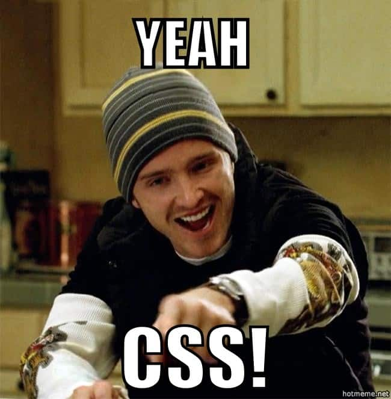

Hey there, yogi bear. Tired of creating gifs? Seriously, that takes time and most of the time it has a huge file size and a crappy resolution. What if you can create a gif(ish) element out of CSS? Because you can.

CSS has come a long way we can now create our own GIF-ish contents and the best part, we have full control over it.



**Great, how do I do it?**

First things first, we need our html structure that will hold all the things we need. There's the container:

```js
<div class="container"> <!--There's the container that centers it-->
    <div class="spinner-frame"> <!--The background-->
        <div class="spinner-cover"></div> <!--The Foreground-->
        <div class="spinner-bar"></div> <!--and The Spinny thing-->
    </div>
</div>
```
  
Easy, right? Now we need to add them styles to our html's.

```css
.container {
    position: fixed;
    top: 0;
    left: 0;
    right: 0;
    bottom: 0;
    text-align: center;
    background: #eee;
}
.container:before {
    content: "";
    height: 100%;
    display: inline-block;
    vertical-align: middle;
}
```
  
Since, it's a spinner and normally covers the whole page. The combination of "position: fixed" and bottom, top, left, right as 0 will do that for you. ( _We don't want the users to click everywhere, right?_).

The :before pseudo element will help you center the spinner correctly (without the help of negative margins). How? If you look at the container class, it has a "text-align: center" which aligns inline elements like the pseudo element :before. But, we need to add height on that thing and inline elements do not like that. So, we need to change the display from inline to inline-block and add "vertical-align: middle" so it aligns vertically.

**Now the for the fun stuff.**

We need to style the spinner frame.

```css
.container .spinner-frame {
    display: inline-block;
    vertical-align: middle;
    width: 100px;
    height: 100px;
    border-radius: 50%;
    position: relative;
    overflow: hidden;
    border: 5px solid #fff;
    padding: 10px;
}
```
A couple of things here. Since it's a DIV, by default it's a block element. We need to change that to an inline-block so it accepts the text-align and centers itself with the :before pseudo element. Then add a "vertical-align: middle" and viola!! Centered!

A spinner won't be a spinner if it's not a circle. A 50% border-radius will work properly if you have a perfect 1:1 ratio. Now we need to push everything inside (and automatically center it), adding consistent padding will do that for you.

Now for the foreground or spinner-cover.

```css
.container .spinner-frame .spinner-cover {
    background: #fff;
    width: 100%;
    height: 100%;
    border-radius: 50%;
    position: relative;
    z-index: 2;
}
```
  
This will add a white cover on top of the spinner and hide everything that we don't need inside it. You know what they say... If you can't remove it, hide it.

For the spinny thing:

```css
.container .spinner-frame .spinner-bar {
    background: #29d;
    width: 50%;
    height: 50%;
    position: absolute;
    top: 0;
    left: 0;
    border-radius: 100% 0 0 0;
    -webkit-animation: spinny 2s linear infinite;
    transform-origin: 100% 100%;
}
@-webkit-keyframes spinny {
    0% {
        transform: rotate(0deg);
        background: #29d;
    }
    50% {
        transform: rotate(180deg);
        background: #00427c;
    }
    100% {
        transform: rotate(360deg);
        background: #29d;
    }
}
```
  
This one needs more advance CSS in it because this is the only thing that moves.

We need to tell the element that the center point is not on the center of the element but on the bottom right edge where it spins. The CSS "transform-origin: 100% 100%" will do that easily for you.

Since it's an animated element, overflow hidden (for some reason) doesn't work on this guy. So, we need to curve to top left part of it. The CSS "border-radius: 100% 0 0 0" will do that for you.

We also need to push it on the top left where it starts spinning "position: absolute" with top and left 0 will push it there.

Now we need to animate it using key-frames. From 0% to 100% the "transform: rotate()" from 0 degrees (0deg) to 360 degrees (360deg) will rotate it forever. FOREVER!

A tutorial wouldn't be complete without a demo.

See the Pen [azVwqj](http://codepen.io/notdarryltec/pen/azVwqj/) by Darryl Tec ([@notdarryltec](http://codepen.io/notdarryltec)) on [CodePen](http://codepen.io).
