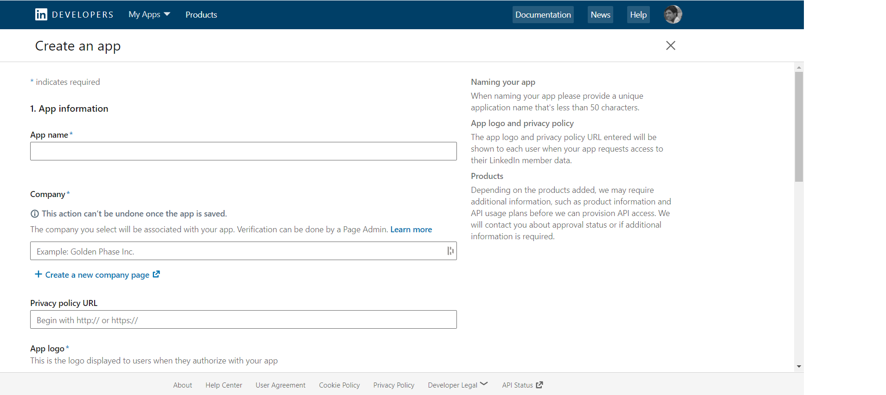
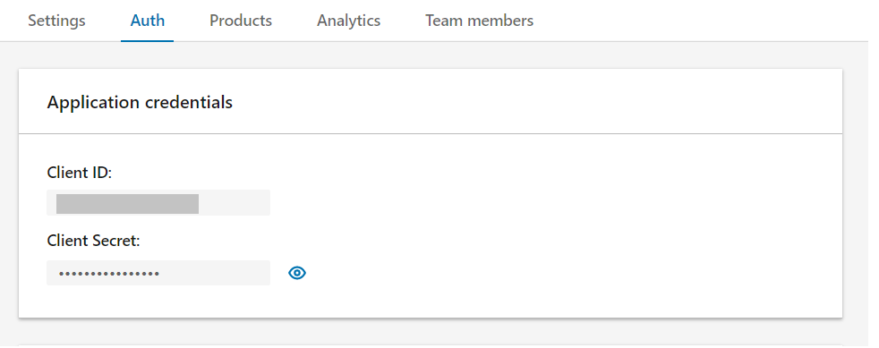
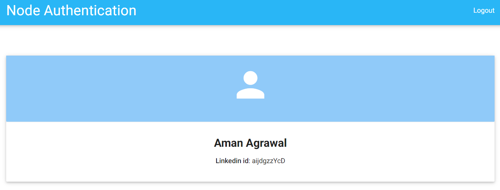

This blog article will guide you to add "log in with LinkedIn"
functionality in your application. Here we will be implementing **Linkedin Login**  using NodeJS and [Passport](http://www.passportjs.org/). 

Passport is an authentication middleware for Node, which authenticates requests and delegates all other functionality to the application. Considering the unique application requirements, Passport has stuck to authentication mechanisms known as strategies. In the blog, we will be implementing a similar strategy for Login with Linkedin.


## Pre -Requisites: 

 1. Basic Knowledge of NodeJS 
 2. Node JS should be installed on your system. 

## Steps to configure 
1. Creating Linkedin `APP_ID` and `APP_SECRET`

  - Go to https://www.linkedin.com/developers/ and login with your Linkedin account. 
  - Once you have registered, click on the `create app` link and add the required details to create an app



Provide basic details about your app:
- App name
- Company
- Privacy policy URL
- Business email
- App logo

  - After creating apps go to the `auth` tab in the navigation bar as shown below. You can now copy your secret and ID from here 

  


2. Now enough, let's move to code, First of all, create a directory named `Linkedin-node-authentication`
```
mkdir Linkedin-node-authentication
```

3. Move to the directory `Linkedin-node-authentication/`

```
  cd Linkedin-node-authentication
```
4. In the root create a file `package.json` and copy the following code 

The dependencies, we are going to use in the projects are 

 - `express` : Node web framework
 - `express-session` Session managment of express
 - `passport` Authentication middleware for Node.js 
 - `passport-linkedin-oauth2` A simple passport strategy for LinkedIn OAuth2 [http://www.passportjs.org/packages/passport-linkedin-oauth2/](http://www.passportjs.org/packages/passport-linkedin-oauth2/)
 - `ejs` - Templating engine

```json
{
  "name": "linkedin-login-node",
  "version": "1.0.0",
  "description": "Basic application for setting up Linkedin login using node and passport",
  "main": "index.js",
  "scripts": {
    "test": "echo \"Error: no test specified\" && exit 1",
    "start": "node server.js"
  },
  "author": "LoginRadius",
  "license": "ISC",
  "dependencies": {
    "ejs": "^3.1.2",
    "express": "^4.17.1",
    "express-session": "^1.17.1",
    "passport": "^0.4.1",
    "passport-linkedin-oauth2": "^2.0.0"
  }
}

```
 

5. After this run the following command in the terminal
```
 npm install
```

6. Now create a file named `server.js` and paste the following code  

```javaScript
const express = require('express');
const app = express();
const session = require('express-session');
const passport = require('passport');
const LinkedInStrategy = require('passport-linkedin-oauth2').Strategy;
const routes = require('./routes.js');
const config = require('./config')

app.set('view engine', 'ejs');

app.use(session({
  resave: false,
  saveUninitialized: true,
  secret: 'SECRET'
}));

app.use(passport.initialize());
app.use(passport.session());

passport.serializeUser(function (user, cb) {
  cb(null, user);
});

passport.deserializeUser(function (obj, cb) {
  cb(null, obj);
});

passport.use(new LinkedInStrategy({
  clientID: config.linkedinAuth.clientID,
  clientSecret: config.linkedinAuth.clientSecret,
  callbackURL: config.linkedinAuth.callbackURL,
  scope: ['r_emailaddress', 'r_liteprofile'],
}, function (token, tokenSecret, profile, done) {
  return done(null, profile);
}
));

app.use('/', routes);

const port = 3000;

app.listen(port, () => {
  console.log('App listening on port ' + port);
});

```

7. Now create a file named `routes.js ` in the root directory and paste the following code 

```javaScript
const passport = require('passport');
const express = require('express');
var router = express.Router();

router.get('/', function (req, res) {
  res.render('pages/index.ejs'); // load the index.ejs file
});

router.get('/profile', isLoggedIn, function (req, res) {
  res.render('pages/profile.ejs', {
    user: req.user // get the user out of session and pass to template
  });
});

router.get('/auth/linkedin', passport.authenticate('linkedin', {
  scope: ['r_emailaddress', 'r_liteprofile'],
}));

router.get('/auth/linkedin/callback',
  passport.authenticate('linkedin', {
    successRedirect: '/profile',
    failureRedirect: '/login'
  }));

router.get('/logout', function (req, res) {
  req.logout();
  res.redirect('/');
});


function isLoggedIn(req, res, next) {
  if (req.isAuthenticated())
    return next();
  res.redirect('/');
}

module.exports = router;
```
7. Create a directory `views` and under this create a directory named `pages`. Under this folder create two pages named `profile.ejs` and `index.ejs`

```html
// index.ejs
<!doctype html>
<html>

<head>
  <title>Linkedin Node Authentication</title>
  <link href="https://fonts.googleapis.com/icon?family=Material+Icons" rel="stylesheet">
  <link rel="stylesheet" href="https://maxcdn.bootstrapcdn.com/font-awesome/4.7.0/css/font-awesome.min.css">
  <link rel="stylesheet" type="text/css"
    href="https://cdnjs.cloudflare.com/ajax/libs/materialize/0.97.5/css/materialize.min.css">
  <style>
    .linkedin {
      background-color: #0073b1 !important;
      color: #fff !important;
    }
    .fa-linkedin-f:before,
    .fa-linkedin:before {
      content: "\f0e1";
    }
  </style>
</head>

<body>
  <nav class="light-blue lighten-1" role="navigation">
    <div class="nav-wrapper container">
      <a id="logo-container" href="#" class="brand-logo">Node Authentication</a>
    </div>
  </nav>
  <div class="section no-pad-bot" id="index-banner">
    <div class="container">
      <br><br>
      <div class="row center">
        <div class="col s6 offset-s3">
          <div class="card">
            <div class="card-content">
              <span class="card-title">Linkedin Login using Node and passport</span>
            </div>
            <div class="card-action">
              <a href="/auth/linkedin" class="waves-effect waves-light btn social linkedin">
                <i class="fa fa-linkedin"></i> Sign in with Linkedin
              </a>
            </div>
          </div>
        </div>
      </div>
    </div>
  </div>
</body>

</html>
```


```html
<!- profile.ejs->
<!doctype html>
<html>

<head>  
  <title>LinkedIn Node Authentication</title>
  <link href="https://fonts.googleapis.com/icon?family=Material+Icons" rel="stylesheet">
  <link rel="stylesheet" type="text/css"
    href="https://cdnjs.cloudflare.com/ajax/libs/materialize/0.97.5/css/materialize.min.css">
  <style>
    .card:hover {
      box-shadow: 0 10px 20px rgba(0, 0, 0, 0.19), 0 6px 6px rgba(0, 0, 0, 0.23);
      margin-bottom: 54px;
    }
  </style>
</head>

<body>
  <nav class="light-blue lighten-1" role="navigation">
    <div class="nav-wrapper container">
      <a id="logo-container" href="#" class="brand-logo">Node Authentication</a>
      <a href="/logout" class="right">Logout</a>
    </div>
  </nav>
  <div class="section no-pad-bot" id="index-banner">
    <div class="container">
      <br><br>
      <div class="row center">
        <div class="col s12">
          <div class="card">
            <div class="card-content blue lighten-3">
              <span class="card-title white-text"><strong><i class="large material-icons">person</i>
                </strong></span>
            </div>
            <div class="card-action">
              <h5><b><%= user.displayName %></b></h5>
              <p><strong>Linkedin id</strong>: <%= user.id %></p>
            </div>
          </div>
        </div>
      </div>
    </div>
  </div>
</body>

</html>
```
8. Finally, when you are done with the above code you can now write all your app details gathered in *step 1* to `config.js` file created in the root directory 

```JS
module.exports = {
  'linkedinAuth': {
    'clientID': '<CLIENT_ID>', // your App ID
    'clientSecret': '<CLIENT_SECRET>', // your App Secret
    'callbackURL': 'http://127.0.0.1:3000/auth/linkedin/callback'
  }
}
```
9. Let's have a final check with the repository, aftre follwoing all the steps in the same pordr the directory structure of your code will look like below:  

  ```
  // Final directory structure
  Linkedin-node-authentication/
    --|node_modules
    --|views/
      |--|pages/
      |----|error.ejs
      |----|profile.ejs
      |----|index.ejs
    --|config.js
    --|package.json
    --|package-lock.json
    --|routes.js
    --|server.js
  ```

10. Now run the server by executing below command in the directory `Linkedin-node-authentication/ `

```
npm start
```
8. Visit the browser with the URL `http://localhost:3000`


  

  Click on the sign in button, and you will be asked to login through Linkedin. Once logged in you will be redirected to profile page as below:

  

  The complete sample code for the above tutorial can be found [here](https://github.com/LoginRadius/engineering-blog-samples/tree/master/NodeJs/LinkedinLoginPassport)