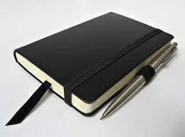

Ever wondered how I work? No? Well, too bad, I'm still gonna write about it. Hello and welcome to a blog post dedicated to me. In this episode, I'm going to tell you about the tools I use, the things I do to get design inspiration, and what I do when I get stuck on a project.

Let's get started!

## Tools I use

#### Coffee

Let's face it, you all know this is the number 1 priority for pretty much everyone you know. Getting my fuel up and over driving my brain... And hope to god I don't break down in the middle of the day.

#### Sublime Text 3

The Photoshop to my coding skills. Sure, there are other text editors out there but this one really knows what it's doing. I have come to the point where I've installed so many Sublime Packages that I cannot function without them.

Some of those packages are:

1. **Emmet** Boy, oh boy, Let me tell you about Emmet. But, it would take a long time to explain what it is, so just go to their [site](http://emmet.io/). It's basically premade snippets for pretty much everything you need.
2. **SidebarEnhancement**Sublime's sidebar is a little bit underdeveloped. Then again, that's what packages are for, right? This nifty little package ehances your sidebar with more options to choose from like: '_Reveal..._' (which opens the file folder).
3. **ColorHighlighter**If you're the kind of person who remembers the hex code for colors, you are one talented individual. Ya see, it's hard to visualize colors using hex code. ColorHighlighter puts a background on those colors for you to easily visualize what kind of color #00427c is (regal blue, btw).
4. **SFTP**This one is a cool package. It lets you edit, sync, and save on-upload files from any of your sftp or ftp servers. But only if you configure it properly. If you use any preprocessors and you're worried that you have to upload the processed file manually. Worry no more as you can make sftp monitor that file if it has changed and automatically upload it. Pretty neat, huh?

_And since we're talking about sublime and packages, [check out this nifty blog about sublime text and their packages.](/blog/beginners-guide-for-sublime-text/)_

#### Codekit

If you don't know what is codekit, you should. It compiles everything from SASS to HAML to Coffeescript. It also auto refresh your browser on every save. It... it just works. Bower is also built-in so you have access to over 6,000 components. Best part? No command line usage. Just drop your project files and go.

## What I do to get inspired.

As a normal human being — and not an extraterrestrial or alien as you tiny humans may call it. I tend to get stuck in a design black hole. It is where every ideas you have is just 1 big blank canvas — or as some artists call it "modern art". So what do I do when I don't have any ideas? It's simple really. The first website I go to is [dribbble.com](http://dribbble.com). Dribble used to be an invite-only social network for designers. I think they probably opened their doors to everyone. I'm not really sure. But, I am sure that most of the designers there are still the best of the best. What I really like about it is when some designers show how their designs interact with users. With the help of GIF or [codepen](https://codepen.io/). Speaking of codepen, That's the place I go to if I am in need of some CSS trickery. At some point, I do get inspiration from that place too. If dribbble can't help my —oh so in the dark— brain, I go to Pinterest. Pinterest have their own design category with a bunch of different sub categories from Graphic Design to UI/UX. The best thing about it? It links back to another site with more design inspiration. YAY for Pinterest.

### Getting out of a sticky situation

Now that my brain is full of design food. How do I put it to work? There's this thing called a notebook. If you don't know what that is. It looks like this.  This is where I start sketching or wireframing all the things I need before moving on to the digital format. And there you have it. A sneak peek on how I work. I hope that this gave you an idea on how to improve your everyday design life. A word of advice. _There are a thousand ways to do 1 thing. If someone told you it can't be done; prove them wrong._
