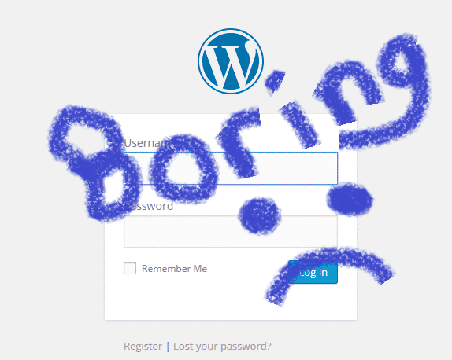

In this tutorial I will demonstrate how to build a custom login form scratch. This time instead of using the default function call Wordpress provides us, we will create this login form and the styling from scratch, making it a very customized form. I will be providing the CSS I am using, however you may style this however you wish.

## Building a Custom Login Form



This is what WordPress gives us out of the box.. Boring, right?

I am going to show this part once again because it is probably the easiest to implement for beginners. I covered this in Part 1, but we'll go through it again just in case you're skipping ahead

To start our page theme you will need to do the following

1. Install WordPress
2. Navigate to your wp-content/themes folder and choose a theme to edit or install a new one
3. create a file called page-login-custom.php in the theme directory (Notice we are now making a new Page Theme)
4. Next open that file with a text editor of your choosing and add the following at the top of the php file

\-->

To initialize this page template make sure to activate the theme you've selected and then navigate to a page or post. On the right hand side of your page/post editor you should now see a dropdown available for template. Change your template to Login Custom and that will attach that page theme to this page/post.

Now for the custom code. Below I have provided an example of some code that I have customized to make my custom login form.

```js


<form method="post" action="" class="wp-user-form">

:
<input type="text" name="log" value="" size="20" id="user_login" tabindex="11" />

:

Remember me

<input type="submit" name="user-submit" value="" tabindex="14" class="user-submit" />
<input type="hidden" name="redirect_to" value="" />


```


Lets take a look at that custom form


## Handling the Login Form response

To handle the Login Form response use the exact same method we used in part 1. Remember to place that function within your functions.php file within your theme unless you're building a plugin.

In this example we have built a custom WordPress login form that you could customize and style to your desire. In the next section I will be demonstrating how to build a lost password form that is fully customized. Our custom lost password form will send an email to the user as well as handle creating a new password for the user.
